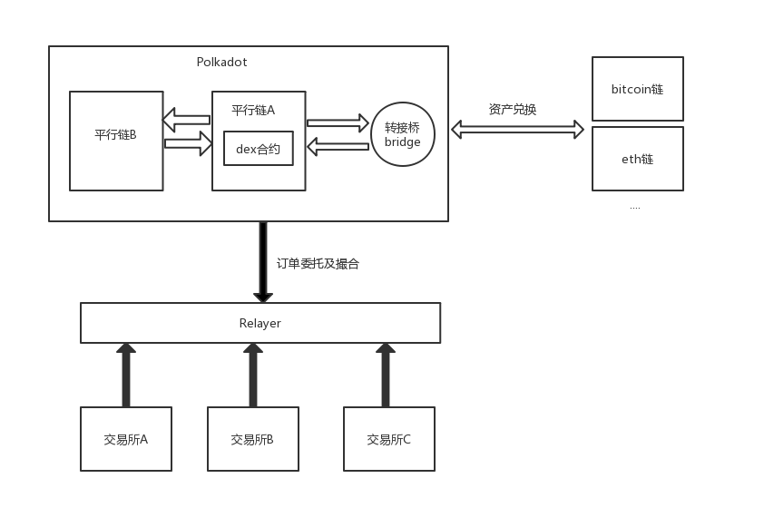
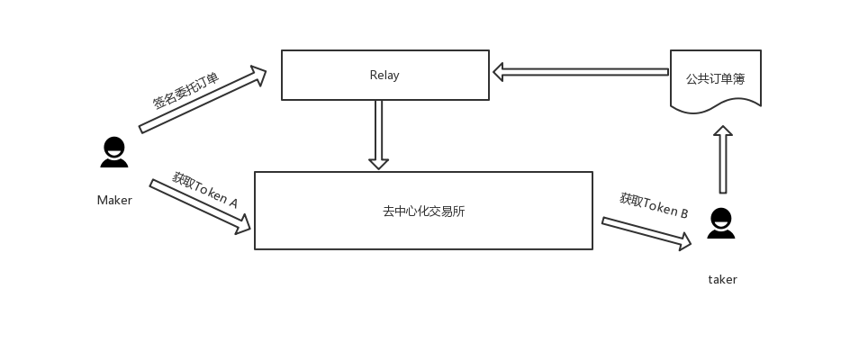

# CDEX 协议， polkadot 上的开放的去中心化交易所协议\*\*

## 背景

传统互联网是传递信息的网络，信息都保存在中心化的机构中，由于缺乏可靠的信任机制，陌生节点间无法完成大规模的价值交换。互联网的发展趋势必然是从信息互联网最终过渡到价值互联网。比特币的出现使得可信的价值转移成为了可能，带动了区块链技术的蓬勃发展。一大批区块链项目发行了自己的代币及公链。种类繁多的代币对于交换提出了强劲的需求，带动了去中心化 Token 互换协议的研究，陆陆续续涌现了 Etherdelta、 0x、IDEX 等基于以太坊去中心化交易协议。

然而 Etherdelta, IDEX 等由链上进行订单处理，结算等协议受限于以太坊的性能，导致用户体验很差，同时每个动作都需要消耗 gas，并且需要等待区块链的确认，极大影响了去中心化交易所的使用。为了解决该问题，0x 协议提出了链下处理订单、链上进行结算，通过把交易订单在链下让中继 relayer 撮合处理，然后再区块链上进行结算确认。这样结合两者之优势，在提升了交易速度的同时，又保证了安全性。

同时我们看到以 0x 协议为代表的价值交换协议却只能用于 ERC-20(ERC-721)代币，众多用于自己主网的代币例如 BTC, EOS, NEO 等无法通过去中心化协议进行交换。目前区块链间呈现出来的这种问题被称作“孤岛效应”，这种孤岛的限状极大影响了去中心化交易所的发展，生态无法对接，体系难以增长。想要形成一个真正的价值互联网，使得不同代币自由流转，就必须链与链之间价值流通的障碍。

因此 CDEX 应运而生，依托于 polkadot 的跨链机制以及 chainx 构建的跨链资产枢纽， CDEX 协议将构建支持大规模，跨链，高速去中心化 dex，打破链间孤岛效应，实现链与链之间的价值互联。

## CDEX 介绍

**CDEX protocol 是基于 polkadot 的跨链去中心化交易所协议。**

0x 协议等去中心化交易所协议是首创链下订单委托撮合，链上资产结算的方式，极大的提升了去中心化交易所得性能，使得去中心化交易所发展进入了新纪元，CDEX 吸收并借鉴 0x 协议的创新，依托于 polkadot 的强大生态以及 chainx 的跨链资产枢纽，将实现任意平行链链间资产委托，BTC、ETH 等主流链的跨链交易，极大拓展去中心化交易所生态，打破链于链间资产交流的障碍。
CDEX 整体架构分为 DEX 合约、转接桥、 Relayer。

Relayer 是订单中继系统，与 CDEX 智能合约交互，主要负责订单撮合与提交上链。Relayer 对外提供 OpenApi. 允许第三方交易所提交订单到撮引擎。
第三方交易所的职责是收集用户提交的订单数据，并将签名的订单提交给 Relayer。 通过 CDEX 协议，不同交易所可以成为分布式商业系统的一部分，共享订单数据和流动性，为用户带来更好的交易深度和体验。

### 平行链资产交换

### 跨链转接桥

**现有的主流链无法通过 CDEX 协议直接进行交换，通过 chainx 提供的跨链资产转接桥，CDEX 协议将使得用户可以充值并交易 BTC, ETH 等资产，从而使得不同链接资产的流通**

## CDEX protocol 工作方式

### 链下订单委托

CDEX 的链下订单模式吸收了 0x 协议的有点。 用户提交订单委托，Relay 收集订单并进行撮合。用户的挂单不会立即提交到链上，而是由 Relayer 的撮合引擎进行订单匹配，找到符合条件的对手单再提交到链上交易。通过这种方式，用户的挂单可以立即被 Relayer 放入订单薄，避免了订单提交到连上的区块等待时间，从而使得 CDEX 协议能够提供近似于中心化交易所的体验。

### 链上订单结算

Relayer 聚集了所有用户的委托订单，一旦发行可以进行匹配的订单则立即撮合将订单提交到链上进行结算。

在于 0x 协议为代表的交易模型中，Taker 提交的交易订单包含了 Maker 的订单信息和自己意愿成交数量。
