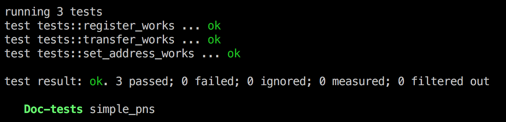
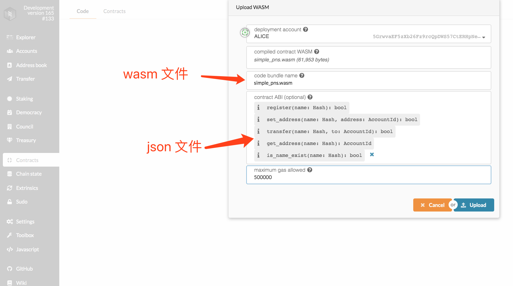
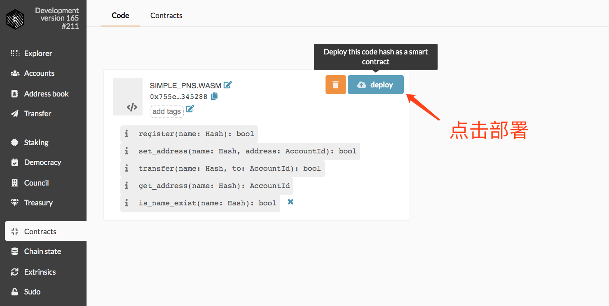
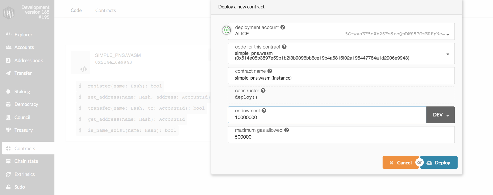
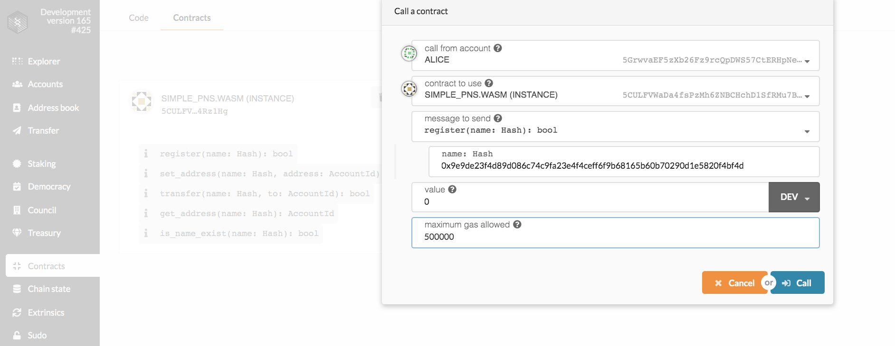
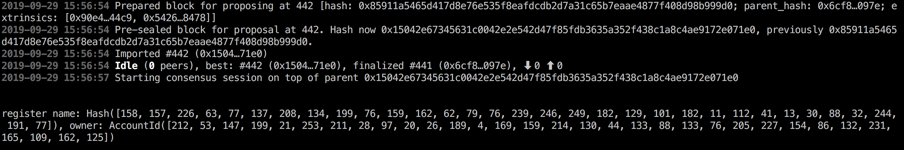

## Polkadot Name Service

一个安全去中心化的 Polkadot 域名系统

### 简介

PNS 是一个建立在 Polkadot 上的域名系统，它的主要功能是**域名解析**，即将一个例如 “polka.dot” 这样一个可读性和可记忆性都非常好的字符串翻译成 Polkadot 上一长串无实际意义的地址。

这样我们就可以在转账、投票以及一些 dapp 操作中使用像 “polka.dot” 这样简单易懂的『域名』而不是冗长难记的『地址』。就好像现实生活中我们我们访问网站使用的是例如 “google.com” 的『域名』，而不是谷歌机房的 ip 地址。

将 “google.com” 翻译成谷歌主机 ip 的服务就是 DNS（Domain Name Service），而目前全球的 IPV4 根域名服务器只有13台，其中9台在美国，2台在欧洲，1台在亚洲，如此中心化的分布也导致了互联网上有一个说法：攻击整个因特网最有力、最直接，也是最致命的方法恐怕就是攻击根域名服务器了。

而相比于 DNS，PNS 由于直接架构在 Polkadot 上，因此天然的拥有去中心化的特点，所以传统的攻击根域名服务器的方法自然无法奏效。

除了基础的域名解析服务，PNS还提供了安全可靠的域名注册、拍卖、转让以及交易等功能。

#### 域名解析



#### 域名注册

eth-ens-namehash 这个 javascript 库提供了 `hash` 和 `normalize` 方法，对域名进行前置处理，使用 `UTS46` 来对域名进行标准化处理虽然支持 `utf-8` 编码的字符，但是同时也导致了一些钓鱼域名可以注册成功。例如 faceboоk.eth 和 facebook.eth 看起来似乎是两个同样的字符串，但是却都可以在 ENS 上注册成功，这是因为第一个 facebook 中的第二个 ο 是其实希腊字母 Ομικρον ，只是看起来一样罢了，而如果允许这样的情况继续发生的话，那么在现代互联网中屡见不鲜的『同形异义字』的钓鱼域名攻击在区块链中依然无法幸免。

所以在 PNS 的域名规则里我们只允许这些字符：`.abcdefghijklmnopqrstuvwxyz1234567890`。虽然这样会有不尊重少数语言的嫌疑，但是为了表面意义上的政治正确而增加用户的资产风险显然是个更加错误的决定。

`.` 这个字符严格意义上并不属于 PNS 域名规则中可以使用的字符，但是它确实会出现在域名中，例如："polka.dot" 和 "chainx.polka.dot"，从前面两个例子可以看出来，这里的`.`和我们常见域名的作用是一样的，即用来区分域名层级而并没有实际的含义。

##### 域名长度

* 短域名（3-6个字符，需要拍卖，示例：chainx.dot）
* 长域名（7-12字符，支付租用费选择租用期限并注册，示例：chainxpool.dot）

##### 注册步骤

> 1.	填写想要注册的域名（如 chainx）
> 2.	选择域名时效（默认1年有效期，可续期，租用费用和租用市场相关，大于3年可给予一定优惠）
> 3.	支付费用提交交易，交易成功后获取域名
> 4.	可选：默认绑定交易地址，可更改绑定地址

##### 拍卖方式：

* 英式拍卖，以一年期租用费用为起拍价，无保留价

* 拍卖系统定期放出一部分短域名进行竞拍，在规定期限内，首次出价最高的用户将会获得域名。     

> 如无人竞拍，域名将以起拍价放置于代理交易系统，任何想获得该域名的用户都可以通过代理交易方式获取该域名。

##### 拍卖时长：

* 5-6 个字符，4周
* 4 个字符，5周
* 3个字符，6周

#### 域名属性

|属性|备注|
| --------   | -------|
|name|域名名称|
|register|域名注册地址（首次注册之后永远保持不变）|
|owner|域名所有人（转让之后将会变更）|
|deletateAddress|代理托管地址（可托管至交易中心）|
|status|域名状态（冻结，可注册，可用，代理出售，竞拍）|
|ownerHistory|域名转让历史（owner列表）|
|address|域名映射地址（owner 可以改变）|
|addressUpdateTime|最近一次更新映射地址时间|
|createTime|域名创建时间|
|updateTime|域名renew时间（每次renew将会更新）|
|ttl|最近一次renew的时效期|

开发者可以根据域名地址获取到域名的所有属性，并构建自己的应用

#### 代理交易

用户可以注册域名，自然就会有卖出域名的需求。而卖出域名的过程具体如下：

Alice 想要卖掉自己的域名，只需要向『代理交易合约』提交一笔包含交易价格、佣金费率（佣金费率决定了你在 PNS 交易系统中的展示优先级）和时效的交易就可以了，交易成功之后该域名会自动进入『代理交易系统』中，而在时效过期之后该域名则会离开『代理交易系统』并返回到 Alice 的归属权下。在时效期内任何愿意购买该域名的用户只需要购买并支付『代理交易合约』中标明的价格就可以获得该域名。

这里会有一个潜在的问题，那就是如果 Alice 和 Bob 认识，并且他们两个人已经商量好了交易价格，在 Alice 挂出域名之后则有可能出现两个非预想的情况：

1.	Bob 没有及时完成购买操作，域名被其他人买了
2.	Alice 在挂出之后就及时通知 Bob 进行购买，但是依然会被一些自动脚本或者恶意抢注的人先行一步的购买成功

针对这两种情况 PNS 还提供了指定购买者地址的可选项，所以只要 Alice 在向『代理交易合约』提交请求的时候指定 Bob 提供的购买者地址就可以保证该域名只会被 Bob 购买成功了。

#### 出价转让

当你发现你想要注册的域名已经被别人注册了的时候，你一定会非常沮丧。在现实世界中为了得到你心仪的域名，你可以通过域名管理网站联系经纪人，然后经纪人去帮助你询问域名拥有者是否愿意转卖，如果对方愿意转卖，在经历过域名管理机构以及域名注册商的转让操作之后，你就可以得到域名了。但是在区块链世界中，似乎没有人可以当你的经济人，在账户匿名的情况下即使你想要付出高额的溢价，也有可能根本联系不到对方。

所以 PNS 同时也提供了出价转让系统，那具体怎么操作呢？我们设想下面一个场景：

Alice 想要注册一个名为 "polka.dot" 的域名，但是发现该域名已经被一个未知用户注册，且该域名既不在『拍卖系统』中，也不在『代理交易系统』中，那么 Alice 就可以向『出价转让合约』发送一个出价转让的申请交易并携带自己愿意支付的报价和一定比例的保证金。

当未知用户登录 PNS 或者任意支持 PNS 的应用时（我们会给所有支持 PNS 的应用提供『出价通知』的插件或工具包），他就会接收到出价转让通知，如果该未知用户同意 Alice 的出价转让请求，则可以通过 PNS 提供的方法将自己的域名转移到『代理交易系统』中，Alice 只需要在『代理交易系统』补足尾款即可获得 "polka.dot" 这个域名。

如果域名拥有者不同意 Alice 的请求，那么无需任何操作，两周之后该请求会自动作废，并返还 Alice 的保证金。

如果 Alice 违约，在两周之内没有补足尾款，那么 "polka.dot" 会在『代理交易系统』中被释放，并把之前支付的保证金分配给『代理交易合约』和域名持有者。

> 在几乎所有的区块链应用中都会强调例如去中心化、匿名、安全等关键字，但是对于真正需要交互的区块链应用来说，匿名或许并不是一个值得称道的点。比如在域名的转让过程中，不可能第一次出价就能够让双方都满意，那么彼此的讨价还价就显得很有必要了。在智能合约里讨价还价技术上确实是可行的，但是实际上是一种为了区块链而区块链的浪费资源且耽误时间的行为。因此如果我们可以将用户的联系方式（Email）作为域名的一个属性（如果能够切实的对用户提供便利，那么用户可能并不介意填写自己的电子邮箱），那么毫无关联的两个用户完全可以通过更高效的方式完成域名价格的确定，然后再通过 PNS 提供的『代理交易合约』来安全的完成域名交易，这样既兼顾用户体验又确保交易安全性的交互方式或许更加符合大部分用户的真实需求。

#### 域名管理

在注册或者购买域名成功之后，还需要设置一些基本信息才能更好的使用

1.	更改映射地址
2.	添加子域名
3.	更改owner
4.	renew

#### 合约实现

目前官方提供的智能合约工具已经可以完成一些基础的功能了，所以接下来我们会使用 [ink](https://github.com/paritytech/ink) 实现一个简单的 PNS 。

在此之前，建议先阅读 ink 相关的[教程](https://substrate.dev/substrate-contracts-workshop/#/)。

这里我们主要实现**域名注册**、**设置地址**、**域名转移**以及**域名查询**这几个功能。

##### 创建合约

运行 `cargo contract new simple-pns`，新建一个合约项目。

##### 定义合约结构

``` rust
    struct SimplePns {
        /// A hashmap to store all name to addresses mapping
        name_to_address: storage::HashMap<Hash, AccountId>,
        /// A hashmap to store all name to owners mapping
        name_to_owner: storage::HashMap<Hash, AccountId>,
        default_address: storage::Value<AccountId>,
    }
```

其中 `name_to_address` 是一个存储**域名**到**映射地址**的 hashmap，`name_to_owner` 是一个存储**域名**到**域名所有者**的 hashmap，`default_address` 是一个类型为 `AccountId` 的空地址。

##### 初始化合约

``` rust
    impl Deploy for SimplePns {
        /// Initializes contract with default address.
        fn deploy(&mut self) {
            self.default_address.set(AccountId::from([0x0; 32]));
        }
    }
```

##### 实现域名操作方法

``` rust
    impl SimplePns {
        /// Register specific name with caller as owner
        pub(external) fn register(&mut self, name: Hash) -> bool {
            let caller = env.caller();
            if self.is_name_exist_impl(name) {
                return false
            }
            env.println(&format!("register name: {:?}, owner: {:?}", name, caller));
            self.name_to_owner.insert(name, caller);
            env.emit(Register {
                name: name,
                from: caller,
            });
            true
        }

        /// Set address for specific name
        pub(external) fn set_address(&mut self, name: Hash, address: AccountId) -> bool {
            let caller: AccountId = env.caller();
            let owner: AccountId = self.get_owner_or_none(name);
            env.println(&format!("set_address caller: {:?}, owner: {:?}", caller, owner));
            if caller != owner {
                return false
            }
            let old_address = self.name_to_address.insert(name, address);
            env.emit(SetAddress {
                name: name,
                from: caller,
                old_address: old_address,
                new_address: address,
            });
            return true
        }

        /// Transfer owner to another address
        pub(external) fn transfer(&mut self, name: Hash, to: AccountId) -> bool {
            let caller: AccountId = env.caller();
            let owner: AccountId = self.get_owner_or_none(name);
            env.println(&format!("transfer caller: {:?}, owner: {:?}", caller, owner));
            if caller != owner {
                return false
            }
            let old_owner = self.name_to_owner.insert(name, to);
            env.emit(Transfer {
                name: name,
                from: caller,
                old_owner: old_owner,
                new_owner: to,
            });
            return true
        }

        /// Get address for the specific name
        pub(external) fn get_address(&self, name: Hash) -> AccountId {
            let address: AccountId = self.get_address_or_none(name);
            env.println(&format!("get_address name is {:?}, address is {:?}", name, address));
            address
        }

        /// Check whether name is exist
        pub(external) fn is_name_exist(&self, name: Hash) -> bool {
            self.is_name_exist_impl(name)
        }
    }

    /// Implement some private methods
    impl SimplePns {
        /// Returns an AccountId or default 0x00*32 if it is not set.
        fn get_address_or_none(&self, name: Hash) -> AccountId {
            let address = self.name_to_address.get(&name).unwrap_or(&self.default_address);
            *address
        }

        /// Returns an AccountId or default 0x00*32 if it is not set.
        fn get_owner_or_none(&self, name: Hash) -> AccountId {
            let owner = self.name_to_owner.get(&name).unwrap_or(&self.default_address);
            *owner
        }

        /// check whether name is exist
        fn is_name_exist_impl(&self, name: Hash) -> bool {
            let address = self.name_to_owner.get(&name);
            if let None = address {
                return false;
            }
            true
        }
    }
```

可以看到在上面具体的方法中我们使用 `env.emit` 触发的一些事件，所以我们还需要定义这些事件：

``` rust
    event Register {
        name: Hash,
        from: AccountId,
    }

    event SetAddress {
        name: Hash,
        from: AccountId,
        old_address: Option<AccountId>,
        new_address: AccountId,
    }

    event Transfer {
        name: Hash,
        from: AccountId,
        old_owner: Option<AccountId>,
        new_owner: AccountId,
    }
```

##### 编写测试函数

``` rust
#[cfg(all(test, feature = "test-env"))]
mod tests {
    use super::*;
    use ink_core::env;
    type Types = ink_core::env::DefaultSrmlTypes;

    #[test]
    fn register_works() {
        let alice = AccountId::from([0x1; 32]);
        // let bob: AccountId = AccountId::from([0x2; 32]);
        let name = Hash::from([0x99; 32]);

        let mut contract = SimplePns::deploy_mock();
        env::test::set_caller::<Types>(alice);

        assert_eq!(contract.register(name), true);
        assert_eq!(contract.register(name), false);
    }

    #[test]
    fn set_address_works() {
        let alice = AccountId::from([0x1; 32]);
        let bob: AccountId = AccountId::from([0x2; 32]);
        let name = Hash::from([0x99; 32]);

        let mut contract = SimplePns::deploy_mock();
        env::test::set_caller::<Types>(alice);

        assert_eq!(contract.register(name), true);

        // caller is not owner, set_address will be failed
        env::test::set_caller::<Types>(bob);
        assert_eq!(contract.set_address(name, bob), false);

        // caller is owner, set_address will be successful
        env::test::set_caller::<Types>(alice);
        assert_eq!(contract.set_address(name, bob), true);

        assert_eq!(contract.get_address(name), bob);
    }

    #[test]
    fn transfer_works() {
        let alice = AccountId::from([0x1; 32]);
        let bob = AccountId::from([0x2; 32]);
        let name = Hash::from([0x99; 32]);

        let mut contract = SimplePns::deploy_mock();
        env::test::set_caller::<Types>(alice);

        assert_eq!(contract.register(name), true);

        // transfer owner
        assert_eq!(contract.transfer(name, bob), true);

        // now owner is bob, alice set_address will be failed
        assert_eq!(contract.set_address(name, bob), false);

        env::test::set_caller::<Types>(bob);
        // now owner is bob, set_address will be successful
        assert_eq!(contract.set_address(name, bob), true);

        assert_eq!(contract.get_address(name), bob);
    }
}
```

##### 运行测试

使用命令 `cargo +nightly test` 来测试合约函数，如果得到下面的结果，证明测试通过。



##### 编译合约和 ABI

使用命令 `cargo contract build` 编译合约，并使用命令 `cargo +nightly build --features ink-generate-abi
` 编译 ABI。

运行成功之后 `target` 目录下会出现相应的 `wasm` 和 `json` 文件。

##### 部署合约

在部署合约之前我们要使用 `substrate --dev` 在本地启动一个 substrate 节点，然后克隆 [polkadot-app](https://github.com/polkadot-js/apps) 到本地，并连接到本地节点。

成功启动之后，我们在 `contracts` 页面上传相应的文件。



上传成功之后，我们还需要部署合约：



然后按照下图输入相应的数值，点击部署：



部署成功后，就可以调用合约的具体函数了，由于目前 ink 以及相关的工具链还不是很完善，想要验证数据只能在合约中使用 `env.println` 来在 `substrate` 节点的控制台中输出相关信息。

> 注意：`env.println` 只在 `substrate --dev` 模式下有效

现在让我们测试一下注册域名能否成功吧~

调用 `register` 函数：



在控制台中查看调用日志：



可以看到控制台中的 `name` 对应 `0x9e9de23f4d89d086c74c9fa23e4f4ceff6f9b68165b60b70290d1e5820f4bf4d`，调用成功！

以上就是使用 ink 开发、测试、编译、部署以及调用合约的主要流程，具体代码见[simple_pns](https://github.com/PolkaX/simple_pns)。

